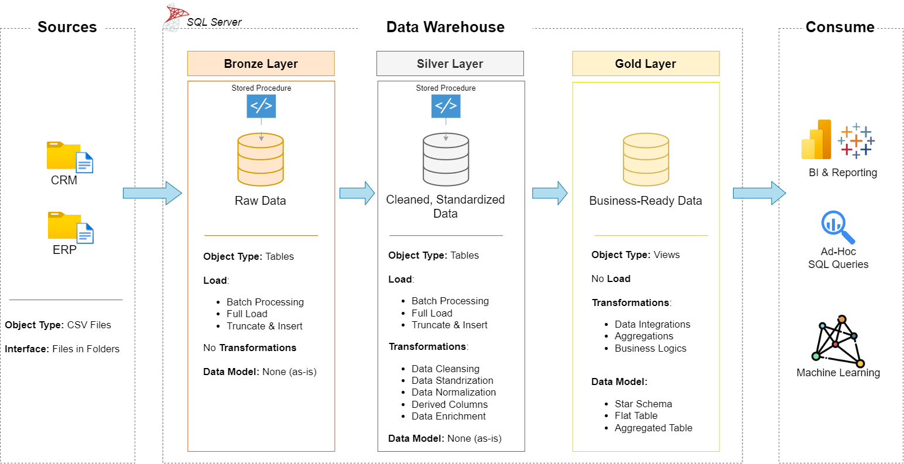
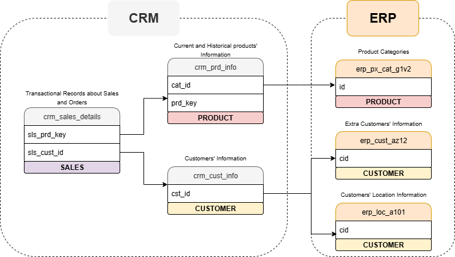
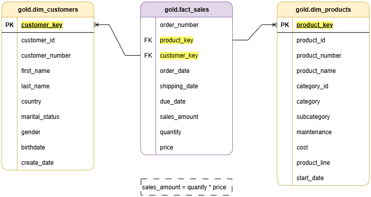

# Data Warehouse Project

This repository contains a small-scale data warehouse project designed to demonstrate fundamental data engineering workflows  — from raw data ingestion to data modeling and transformation - and SQL knowledge.

The project includes:
- **Data ingestion** (from CSV sources)
- **Staging and transformation scripts**
- **Data warehouse schema setup**
- **ETL/ELT orchestration**
- **Documentation** to guide each phase

## Project Description

> **Important Note:**  
> The overall **idea, structure, and task breakdown** for this project are based on the original work by [DataWithBaara](https://github.com/DataWithBaara).  
> I followed Baara's public educational material to build and implement this project from scratch using my own code, while adhering to the conceptual framework provided.
>
>  All scripts in this repository are written by me as a hands-on exercise to reinforce my learning and practical skills in data warehousing but originates from tasks delegated by Baara and follow style, naming conventions and practice suggested by him.

The data architecture for this project follows Medallion Architecture **Bronze**, **Silver**, and **Gold** layers:

1. **Bronze Layer**: Stores raw data as-is from the source systems. Data are ingested from CSV files into SQL Server Database.
2. **Silver Layer**: This layer includes data cleansing, standardization, and normalization processes to prepare data for analysis.
3. **Gold Layer**: Houses business-ready data modeled into a star schema required for reporting and analytics.

Data flow from the sources to the last layer as shown in the diagram below:

 

Data were cleaned, standardized, normalized and integrated into the silver layer as shown below:

Into the gold layer, tables from the silver layer were joined into facts and dimension tables, columns were renamed to be user-friendly and surrogate keys were adopted to create the final data star model shown below:

Data contained into the final model are catalogued here:  while details related to the naming conventions followed throughout this project can be checked here:   

##  Acknowledgments

- Huge thanks to **[DataWithBaara](https://github.com/DataWithBaara)** for sharing the project structure and guiding tasks that inspired this work.
- This project is for educational and portfolio purposes, built with full credit to the original idea author.  
  Please visit [DataWithBaara’s GitHub](https://github.com/DataWithBaara) for more amazing data engineering content.
